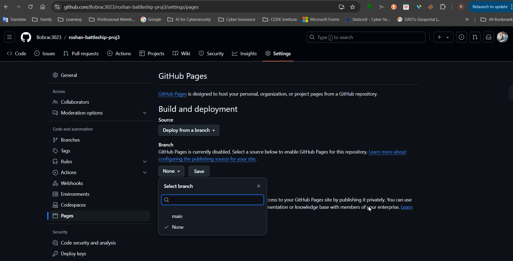
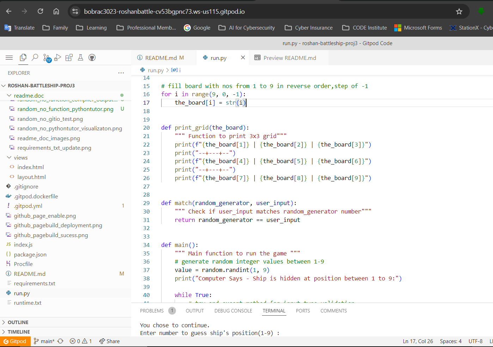

Welcome,

This is the Code Institute student template for deploying your third portfolio project, the Python command-line project. The last update to this file was: **May 14, 2024**

## Reminders

- Your code must be placed in the `run.py` file
- Your dependencies must be placed in the `requirements.txt` file
- Do not edit any of the other files or your code may not deploy properly

## Creating the Heroku app

When you create the app, you will need to add two buildpacks from the _Settings_ tab. The ordering is as follows:

1. `heroku/python`
2. `heroku/nodejs`

You must then create a _Config Var_ called `PORT`. Set this to `8000`

If you have credentials, such as in the Love Sandwiches project, you must create another _Config Var_ called `CREDS` and paste the JSON into the value field.

Connect your GitHub repository and deploy as normal.

## Constraints

The deployment terminal is set to 80 columns by 24 rows. That means that each line of text needs to be 80 characters or less otherwise it will be wrapped onto a second line.

---

Happy coding!

## Battleship Game - Guess the Ship Location

## Introduction
The battelship game is one of the most popular game used to demonstrate the use of "python" language, its versality and ease of use.
The choice of this game for this project is to present the ***user*** with a game of logic, where their skills are tested against a machine, in this case a computer. It is a ***single player*** game, wherein the computer generates a random number to mark the ships location. A ***3x3*** grid presents a visual representation for hits, misses, and the ships location. The user is presented with relevant messages for guidance throughout the game. 

## Features
-The project code is written in python 3 inside the code institute IDE.   
-Github is used to host the repository.  
-The logic for the entire coding is broken up in multiple parts- ***functions, while-if-else loops*** and ***try except*** methods.

-Install pytz package and then Import of ***dateline*** module to display the date, month, year and time in UTC.  
-Import of  ***random*** module to generate random numbers for the game.  

-A 3x3 grid displays numbers from 1 to 9 . Used for visual representation of the ship location, hits and misses during the game.  
-A ***match*** function **checks and matches** the  ***user_input*** with input from the ***random module***.  

-A ***Main*** function ***FIRST*** checks for input value and data type validation  with a ***while--if-else*** loop .  
- The input solicited from the users is an ***integer*** between 1 to 9. ***Floats and strings*** are not allowed.  
- ***try except*** method is used to handle exceptions.  
- Relevant ***print*** messages warn the user about what input is expected.  

-The Second part of the ***Main*** function has a ***while--if-elif-else*** loop to solicit user response after every input.  
- The input solicited from the user is a ***yes*** or ***no***. ***Floats and integers*** are not allowed.  
- If the user input is"yes", a new random number is generated and game continues.  
- If the user input is "no", the games exits and user is displayed a **Goodbye** message.   

-The ***Grid*** displays **"H"** for hits, **"X"** for misses and **"L** for the correct ship position.  
-The game is designed to allow the user to play as long as they wish.  

## Install Pytz package.

## Validator Testing
-Each piece of code and function was tested independently and with other functions using three tools listed below:-  
- Test functions and pieces of code at Programmiz.com  (https://www.programiz.com/online-compiler/7oVd1BFsuE3Bd).  
- Visualize Code execution - pythontutor (https://pythontutor.com/cp/composingprograms.html#mode=edit).  
- gitpod IDE environment  (https://bobrac3023-roshanbattle-cv53bgpnc73.ws-us115.gitpod.io/).  

### Testing and validating print_board function

### Testing and validating random no generation inside the Main function

### Testing and validating input type and data type inside the Main function

### Odd Quirk issue with the input statement 

## Deployment

### Deployment from GitHub
-The site was deployed to GitHub pages as below.  
-In the GitHub repository,
-   Navigate to the Settings tab,
-   Select pages
-   Under **Branch** dropdown, change to **Main** hub from **none**.

-select_branch_github_deployment

-From the **Actions** tab, select **Deployment** to check deployment status and capture external link.

### Github_page_deployment

-Once the main branch has been selected, the page will automatically refresh to indicate the successful deployment.

-The live link can be found here - https://bobrac3023.github.io/roshan-battleship-proj3/

### Gitpod after creation from Github Repository using Code-Institute-Org/python-essentials-template

### Code_ide_environment

### git_add_commit_push_command

-use gitpod commands to add, commit code to gitub repository.  
-gitpod push command to push commited changes to github repository 

## Heroku 

-pip3 freeze > requirements.txt output 

-Heroku Eco Dynos Plan config

-Heroku Buildpacks Config- Add python and Nodejs

-Heroku Github conectivitiy and deployment 

-Heroku app deployed 

## Credits
-Extra help to understand key python concepts.  
    https://www.youtube.com/watch?v=KzqSDvzOFNA.  
    https://www.youtube.com/watch?v=piJc18hcH0Y.  
    https://www.youtube.com/watch?v=CasqhmeopnU.  
    https://www.youtube.com/watch?v=8UCIvrs9LZw.  
    https://www.youtube.com/watch?v=Ej7I8BPw7Gk.  
    https://www.youtube.com/watch?v=PY9hvAFrxMI.  
    https://pythonbasics.org/try-except/  
    https://www.youtube.com/watch?v=TqPzwenhMj0&list=PLsyeobzWxl7poL9JTVyndKe62ieoN-MZ3&index=6  
    https://www.youtube.com/watch?v=4OX49nLNPEE  
    https://www.youtube.com/watch?v=ON70wvKYops
    https://www.youtube.com/watch?v=kLI31o7mDsA  
    https://www.youtube.com/watch?v=zPFZy6wKhVA&list=PL98qAXLA6afuh50qD2MdAj3ofYjZR_Phn&index=34  
    https://www.youtube.com/watch?v=94UHCEmprCY.  

-Test functions and pieces of code Programmiz.com  (https://www.programiz.com/online-compiler/7oVd1BFsuE3Bd).  
-Visualize Code execution - pythontutor (https://pythontutor.com/cp/composingprograms.html#mode=edit).  

### Content

-design the grid (https://www.youtube.com/watch?v=PY9hvAFrxMI).  
-input validation (https://www.youtube.com/watch?v=ON70wvKYops).  
-validate data type (https://www.youtube.com/watch?v=kLI31o7mDsA).  

### Media
-All images used in this readme file are placed under the readme.doc file.
 